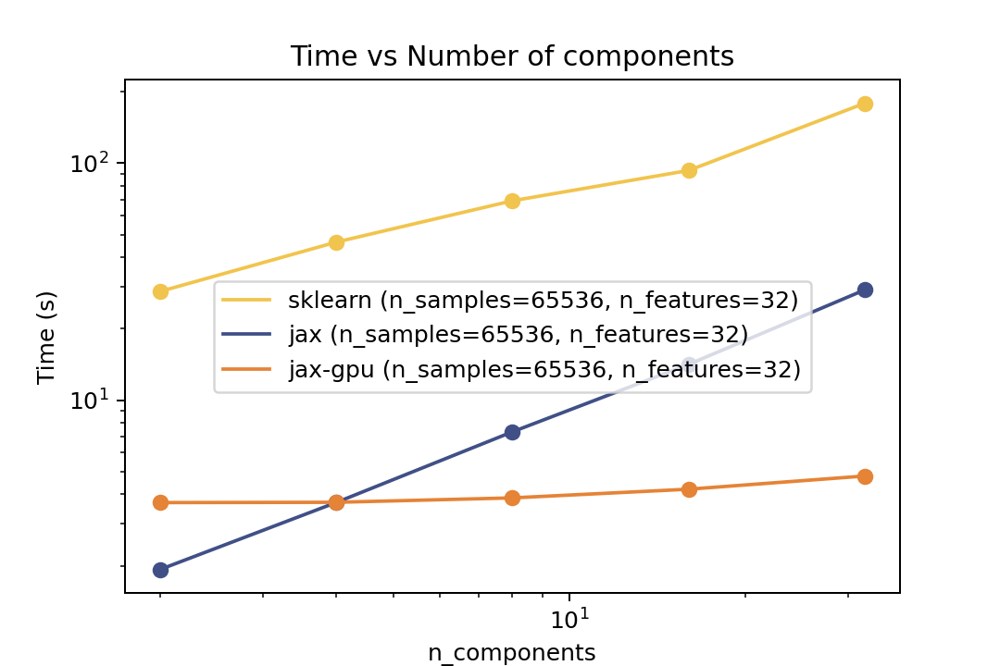
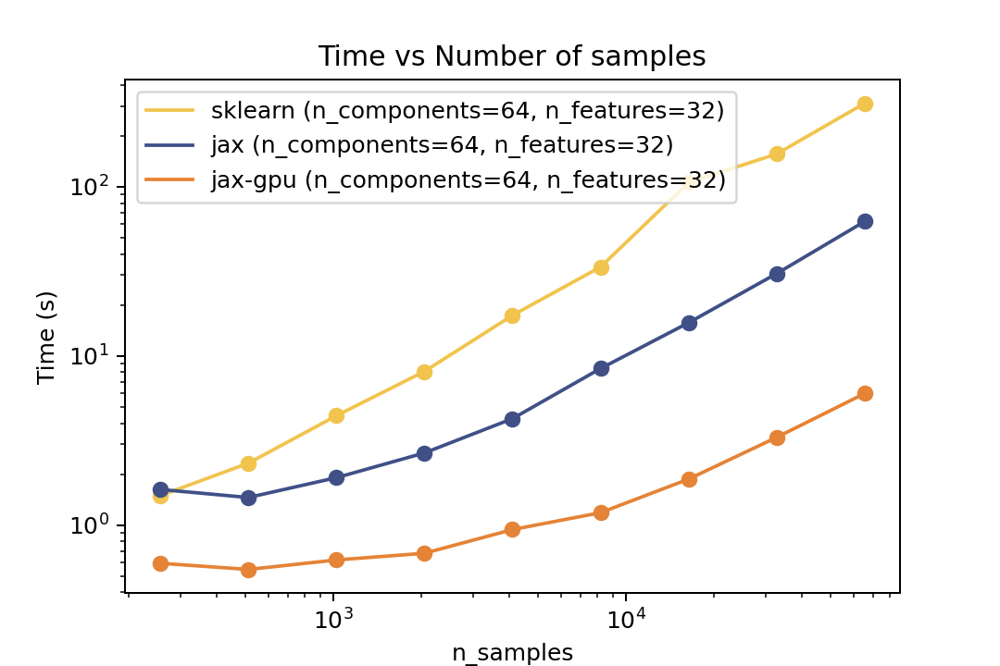

# GMMX: Gaussian Mixture Models in Jax

[](https://img.shields.io/github/v/release/adonath/gmmx)
[](https://github.com/adonath/gmmx/actions/workflows/main.yml?query=branch%3Amain)
[](https://codecov.io/gh/adonath/gmmx)
[](https://img.shields.io/github/commit-activity/m/adonath/gmmx)
[](https://img.shields.io/github/license/adonath/gmmx)
[](https://doi.org/10.5281/zenodo.14515326)

<p align="center">

</p>

A minimal implementation of Gaussian Mixture Models in Jax

- **Github repository**: <https://github.com/adonath/gmmx/>
- **Documentation** <https://adonath.github.io/gmmx/>

## Installation

`gmmx` can be installed via pip:

```bash
pip install gmmx
```

## Usage

```python
from gmmx import GaussianMixtureModelJax, EMFitter

# Create a Gaussian Mixture Model with 16 components and 32 features
gmm = GaussianMixtureModelJax.create(n_components=16, n_features=32)

# Draw samples from the model
n_samples = 10_000
x = gmm.sample(n_samples)

# Fit the model to the data
em_fitter = EMFitter(tol=1e-3, max_iter=100)
gmm_fitted = em_fitter.fit(x=x, gmm=gmm)
```

If you use the code in a scientific publication, please cite the Zenodo DOI from the badge above.

## Why Gaussian Mixture models?

What are Gaussian Mixture Models (GMM) useful for in the age of deep learning? GMMs might have come out of fashion for classification tasks, but they still
have a few properties that make them useful in certain scenarios:

- They are universal approximators, meaning that given enough components they can approximate any distribution.
- Their likelihood can be evaluated in closed form, which makes them useful for generative modeling.
- They are rather fast to train and evaluate.

One of these applications is in the context of image reconstruction, where GMMs can be used to model the distribution and pixel correlations of local (patch based)
image features. This can be useful for tasks like image denoising or inpainting. One of these methods I have used them for is [Jolideco](https://github.com/jolideco/jolideco).
Speed up the training of O(10^6) patches was the main motivation for `gmmx`.

## Benchmarks

Here are some results from the benchmarks in the `benchmarks` folder comparing against Scikit-Learn. The benchmarks were run on a 2021 MacBook Pro with an M1 Pro chip.

### Prediction

| Time vs. Number of Components                                                   | Time vs. Number of Samples                                                | Time vs. Number of Features                                                 |
| ------------------------------------------------------------------------------- | ------------------------------------------------------------------------- | --------------------------------------------------------------------------- |
|  |  |  |

For prediction the speedup is around 2x for varying number of components and features. For the number of samples the cross-over point is around O(10^4) samples.

### Training Time

| Time vs. Number of Components                                               | Time vs. Number of Samples                                            | Time vs. Number of Features                                             |
| --------------------------------------------------------------------------- | --------------------------------------------------------------------- | ----------------------------------------------------------------------- |
|  |  |  |

For training the speedup is around 10x on the same architecture. However there is no guarantee that it will converge to the same solution as Scikit-Learn. But there are some tests in the `tests` folder that compare the results of the two implementations.
